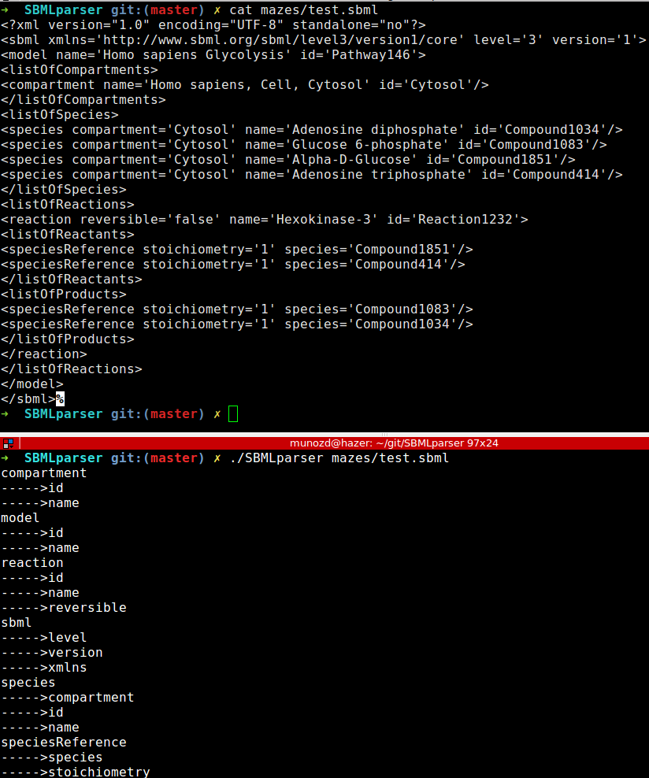

# SBMLparser

Epitech first year project : SBMLparser

Deadline : 5 days

Beginning of the project : 13/06/2016, 08h00

Group size : 1 person

# SBMLparser

This is a program that will print, in alphabetical order, the list of tags and attributes found in the SBML file given as
argument.

Each tag and each attribute will be unique


## Getting started

These instructions will allow you to obtain a copy of the operational project on your local machine for development and testing purposes.

### Prerequisites

What do you need to install the software and how to install it?

```
gcc
make
```

### Installation

Here's how to start the project on your computer

Clone and go in the directory SBMLparser

Project compilation

```
make
```

Running project

```
./SBMLparser [file]
```


## Screenshot



## Build with

* [C](https://en.wikipedia.org/wiki/C_(programming_language))

## Auteurs

* **David Munoz** - [DavidMunoz-dev](https://github.com/davidmunoz-dev)
